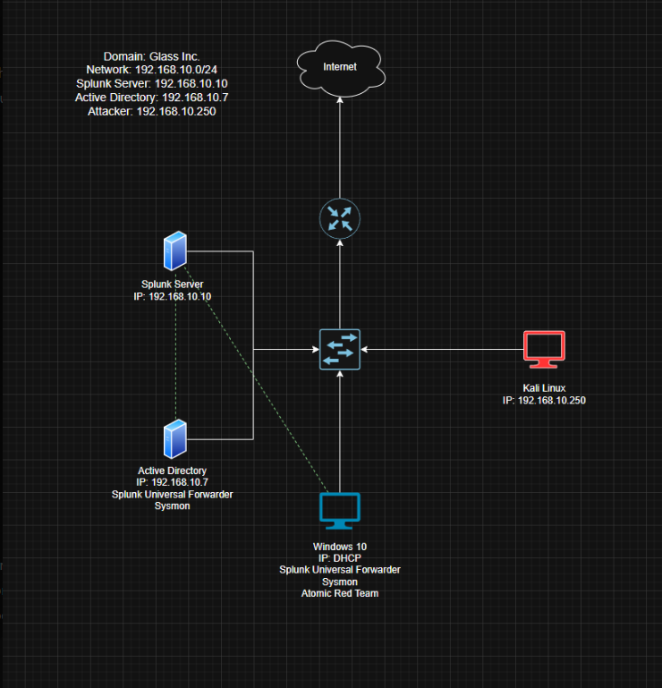

# Active Directory & Splunk Detection Lab

This project demonstrates the setup of a virtual lab environment combining **Active Directory**, **Splunk**, **Sysmon**, and **Kali Linux** to simulate real-world security monitoring scenarios. The environment allows for both **defensive (Blue Team)** telemetry analysis and **offensive (Red Team)** attack simulation, providing hands-on experience with log collection, threat detection, and alerting.

## Project Overview

The goal of this project is to build a homelab that emulates a small enterprise network. In this environment:

- **Windows Server 2022** acts as a Domain Controller running Active Directory and DNS.
- **Windows 10** serves as a domain-joined client, configured with Sysmon, Splunk Universal Forwarder, and Atomic Red Team.
- **Splunk** ingests logs from both the Domain Controller and the client machine to detect suspicious behavior.
- **Kali Linux** simulates an external attacker to generate real-world telemetry such as brute-force login attempts.

This project is intended to demonstrate detection engineering, threat hunting, and endpoint visibility practices.

## Table of Contents

- [Project Setup](#project-setup)
- [Network Configuration](#network-configuration)
- [Virtual Machines](#virtual-machines)
- [Splunk & Logging Setup](#splunk--logging-setup)
- [Active Directory Configuration](#active-directory-configuration)
- [Threat Simulation & Telemetry Collection](#threat-simulation--telemetry-collection)
- [Screenshots](#screenshots)
- [Conclusion](#conclusion)

---

## Project Setup

### Network Diagram



### Prerequisites

- **Oracle VM VirtualBox** for virtualization.
- ISOs for:
  - Windows Server 2022
  - Windows 10
  - Kali Linux
  - Ubuntu Server (for Splunk)
- **Splunk Free** download from splunk.com.
- **Atomic Red Team** project from Red Canary GitHub.
- **Sysmon** from Microsoft Sysinternals.

### Folder Structure
```
AD_Splunk_Project/
│ 
├── assets/ # Screenshots and visual documentation 
├── config/ # Sample config files (e.g., sysmon.xml) 
├── README.md # This write-up
```
---

## Network Configuration

All virtual machines are assigned to a **custom NAT network** called `LabNetwork` using the `192.168.10.0/24` subnet.

| VM             | Role                  | IP Address       |
|----------------|-----------------------|------------------|
| Windows Server | Domain Controller     | 192.168.10.7     |
| Windows 10     | Domain Client         | DHCP / Static    |
| Splunk Server  | SIEM / Log Collector  | 192.168.10.10    |
| Kali Linux     | Attacker              | 192.168.10.250   |

---

## Virtual Machines

### Windows Server (Domain Controller)
- OS: Windows Server 2022
- Roles: Active Directory Domain Services, DNS
- Tools: Splunk Universal Forwarder, Sysmon

### Windows 10 (Client)
- OS: Windows 10 Pro
- Roles: Domain-joined workstation
- Tools: Sysmon, Splunk Universal Forwarder, Atomic Red Team

### Splunk Server (Ubuntu)
- OS: Ubuntu Server
- Role: Central SIEM platform collecting logs from other systems

#### Static IP Configuration

The static IP for the Splunk Server was configured via the Netplan config file:

```bash
network:
  version: 2
  ethernets:
    enp0s3:
      dhcp4: no
      addresses: [192.168.10.10/24]
      nameservers:
        addresses: [8.8.8.8]
      routes:
        - to: default
          via: 192.168.10.1
```
**Screenshot of this configuration is available in the Screenshots section.**

---

# More Sections Coming Soon, Stay Tuned For Updates!